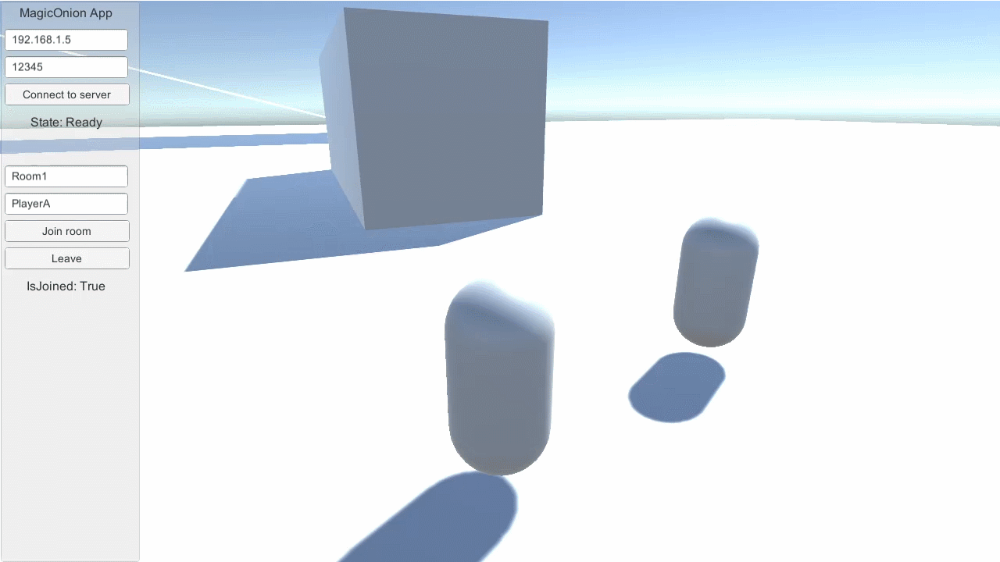

# MagicOnionVoice
An example project for voice chat using MagicOnion and UnityOpus.

## Tested Environment
- Unity 2018.3.14f1
- Visual Studio 2019
- Windows 10 Pro

## Third party assets
The following assets are included in this project.
- [UnityOpus v1.1.0](https://github.com/TyounanMOTI/UnityOpus/releases/tag/v1.1.0)

- [MagicOnion 2.2.0](https://github.com/Cysharp/MagicOnion/releases/tag/2.2.0)  
  Licensed under the MIT License. Copyright (c) 2016 Yoshifumi Kawai

- [MessagePack.Unity.1.7.3.5](https://github.com/neuecc/MessagePack-CSharp/releases/tag/v.1.7.3.5)  
  Licensed under the MIT License. Copyright (c) 2017 Yoshifumi Kawai

- [grpc_unity_package.1.20.0-dev](https://packages.grpc.io/archive/2019/03/ade5193c3fbbcd2c6992edb6ab5b81e146b77140-0361f006-64f5-4261-a455-9e4836367862/index.xml)  

